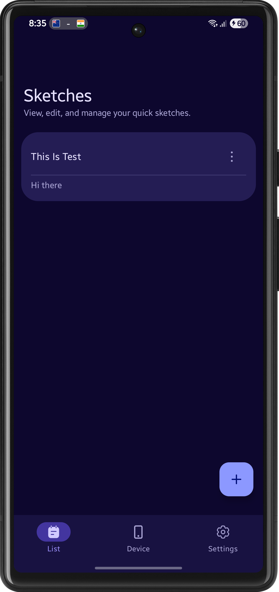
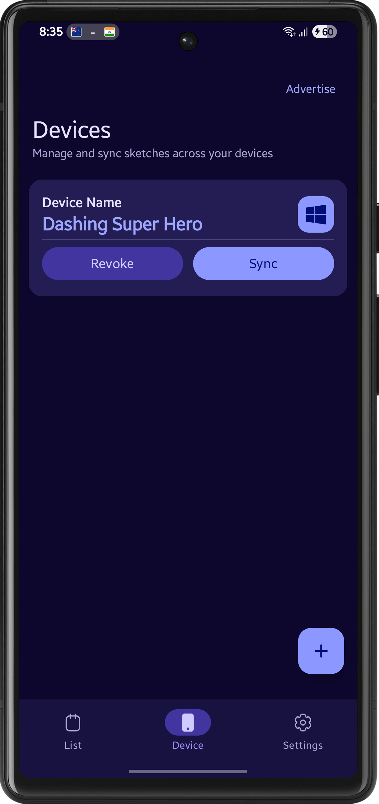
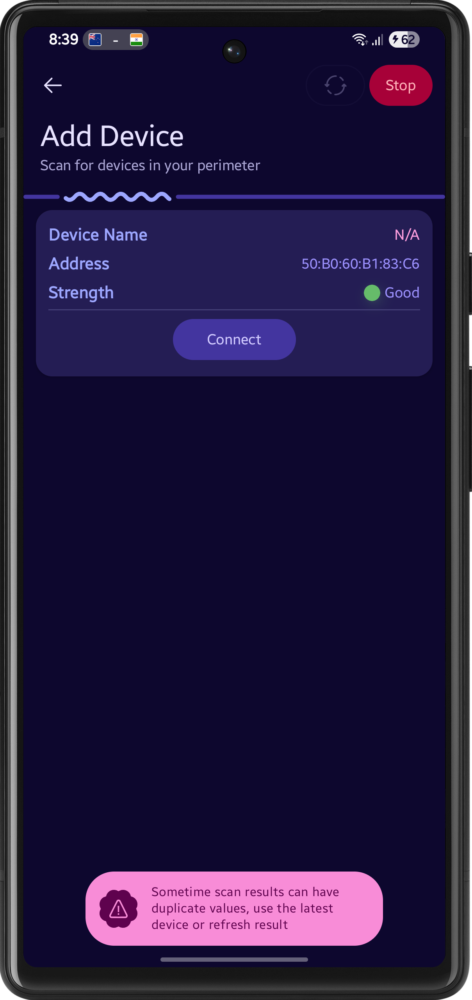
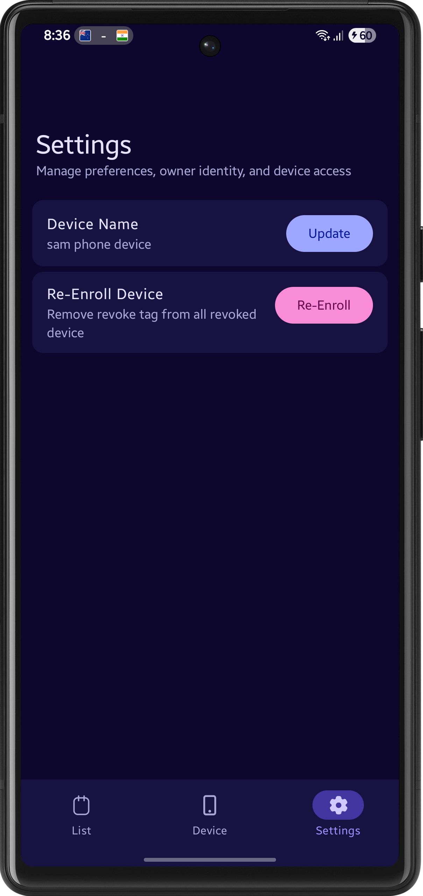
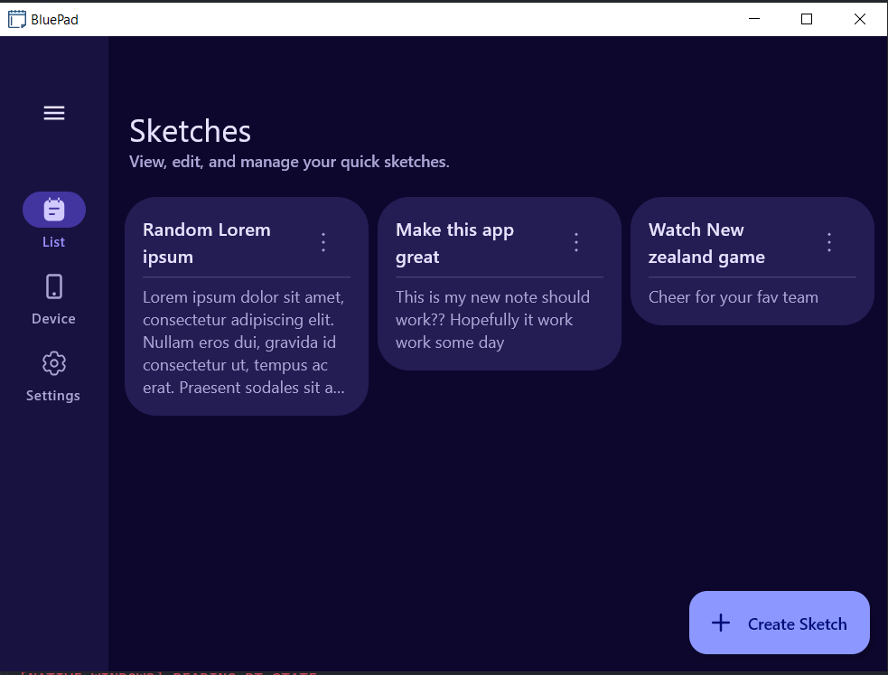
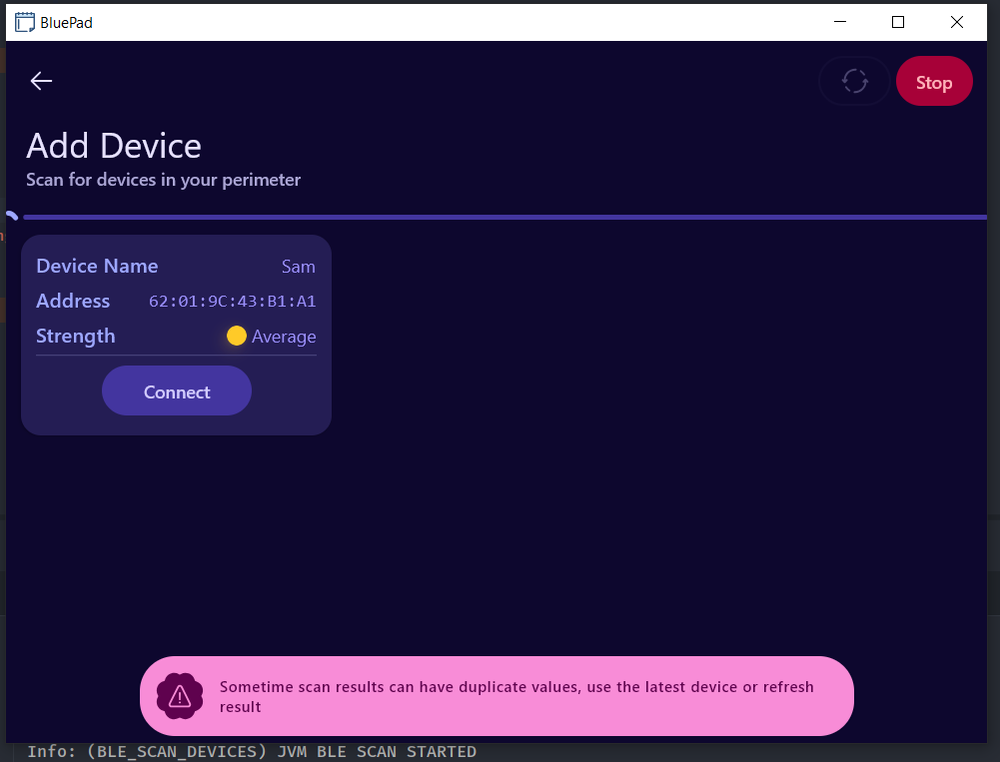
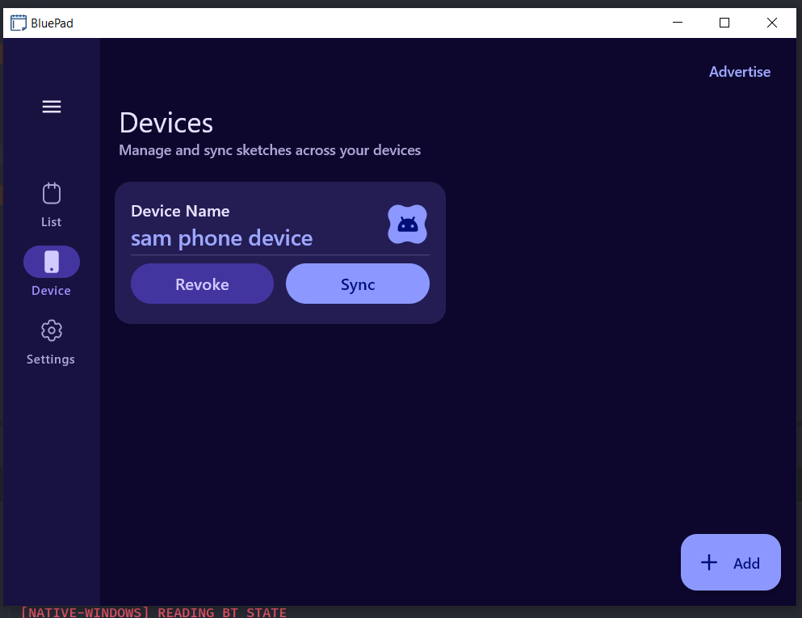

# 🟦 BluePad – Proximity-Based Secure Sketch Sync

<p align="center">
  
  
  
  
</p>

## 📌 About

BluePad is a cross-platform (currently targeting Android and Windows), offline-first sketch and idea
synchronization app built with Kotlin Multiplatform. It allows users to securely sync text-based
sketches between their own nearby devices without relying on the internet,
cloud services, or user accounts.

The core idea is simple: ideas often start on one device and need to move quickly to another.
BluePad makes this possible through explicit, user-triggered syncing between trusted devices,
prioritizing predictability, and platform-friendly behavior.

The project focuses on real-world peer-to-peer communication, clean architecture, and realistic
constraints rather than background magic or always-on syncing.

## 💡 Motivation

Many note and sketch apps rely heavily on cloud accounts, background services, and always-on
connectivity. While powerful, this approach is not always desirable—especially for quick idea
transfer, privacy-sensitive data, or offline environments.

BluePad was motivated by the question:

> _How can two personal devices exchange data securely and predictably using only proximity and user
> intent? No cloud and no internet_

The project draws inspiration from systems like AirDrop and Nearby Share, but deliberately limits
scope to text-based sketches and explicit sync actions to remain feasible within a short development
cycle.

## 📷 Screenshots

#### Android

<p align="center">
   
   
   
   
</p>

#### Windows

<p align="center">
   
   
     
</p>

To check out the working of the app follow this [video](./artwork/video/project_working_video.mp4)

## 🚀 Getting Started

### Prerequisites

- JDK 17+
- Android Studio (for Android target)
- A JVM-compatible desktop environment (Windows OS)

### Clone the Repository

```bash
    git clone https://github.com/tuuhin/BluePad
    cd BluePad
```

### Run on Android

- Open the project in Android Studio
- Select the Android run configuration
- Run on a physical device (Bluetooth required)

> Sync features require real devices. Emulators are not suitable for BLE or Bluetooth testing.

### Run on Desktop (JVM)

- Use the provided desktop run configuration
- Currently, the device only targets windows

## 📦 External Libraries Used

- [Kotlin Multiplatform](https://kotlinlang.org/docs/multiplatform.html) Used to share business
  logic, sync state machines, and data models across Android and Desktop targets.
- [Kotlin Coroutines](https://github.com/Kotlin/kotlinx.coroutines) Used for asynchronous operations
  such as device discovery, networking, database access, and sync workflows.
- [Kotlin Serialization](https://github.com/Kotlin/kotlinx.serialization) Used to serialize sketch
  data and protocol messages for transport across devices
- [Kotlinx DateTime](https://github.com/Kotlin/kotlinx-datetime) Used for platform-independent
  timestamps (creation time, last modified time, sync metadata).
- [Kotlinx Immutable Collections](https://github.com/Kotlin/kotlinx.collections.immutable) Used to
  model UI and sync state safely and predictably without accidental mutation.
- [Compose Multiplatform](https://www.jetbrains.com/compose-multiplatform) Used to build a shared
  declarative UI for Android and Desktop
- [Compose Adaptive & Navigation 3](https://developer.android.com/jetpack/compose/adaptive)Used to
  adapt layouts across different window sizes and manage navigation in a multiplatform-friendly way
- [Material 3 (Compose)](https://m3.material.io) Provides modern Material Design components and
  theming
- [Compose Toast](https://github.com/The-Best-Is-Best/ComposeToast) Used for lightweight user
  feedback during sync events and error states.
- [Koin](https://insert-koin.io) Used for dependency injection across shared and platform-specific
  modules, keeping architecture modular and testable.
- [BuildKonfig](https://github.com/yshrsmz/BuildKonfig) Used to define compile-time configuration
  values shared across platforms.
- [Room](https://developer.android.com/training/data-storage/room) Used for local storage of
  sketches, device metadata, and sync state on Android
- [AndroidX DataStore](https://developer.android.com/topic/libraries/architecture/datastore) Used
  for lightweight key-value storage such as user preferences and pairing state.
- [Kable (BLE)](https://github.com/JuulLabs/kable) Used for Bluetooth Low Energy discovery and
  proximity-based device detection on jvm
- [Kotlin Crypto (SHA-2 & Secure Random)](https://github.com/KotlinCrypto) Used for hashing, nonce
  generation, and session-level cryptographic primitives during sync handshakes
- [Moko Permissions](https://github.com/icerockdev/moko-permissions) Used to manage runtime
  permissions in a multiplatform-safe way, especially for Bluetooth access
- [Kermit](https://github.com/touchlab/Kermit) Used for structured, multiplatform logging across
  shared and platform-specific code

### Platform Utility

We dont have any libraries to check bluetooth advertisement and to read bluetooth state on windows,
thus a small `jvm-utils` module created which contains some java jni code which is inspired
from [simpleble](https://github.com/simpleble/simpleble) java examples

## 📚 What I Learned

- Practical limitations of **BLE discovery** across devices and operating systems
- How the BLE 5.0 stack is differ from the BLE 4.2, (more things on how ble works)
- How selection of **UDP vs Bluetooth Classic** helps in better syncing (idea)
- Structuring Kotlin Multiplatform projects with clear platform boundaries

## 🚧 What Could Not Be Finished

Due to time constraints and scope limitations, the full end-to-end sync pipeline could not be
completed. While discovery, architecture, and platform groundwork are in place, reliable
bidirectional data transfer and conflict resolution remain incomplete.

This was a conscious decision to prioritize architectural clarity and platform experimentation over
partial or fragile implementations.

## 🏁 Conclusion

BluePad served as an in-depth exploration of Kotlin Multiplatform architecture and peer-to-peer
Bluetooth-based communication under real-world constraints. The project emphasizes explicit user
intent, offline-first design, and realistic system boundaries rather than background automation.

It is submitted as a contest entry and is also intended to be extended into a fully functional
device-syncing application in the future
