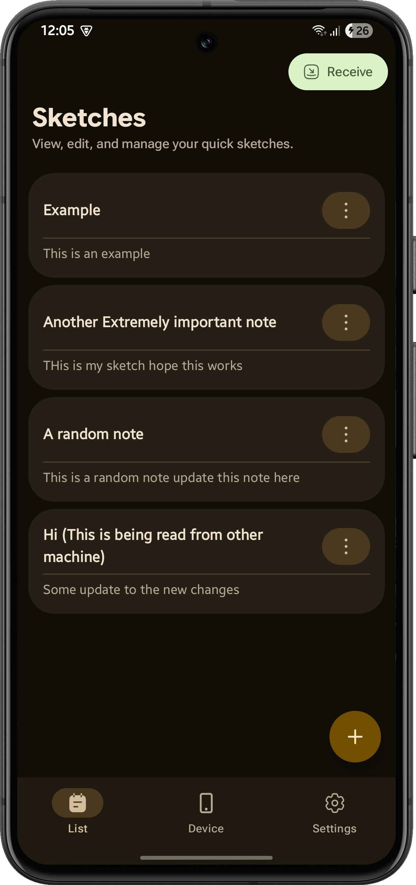
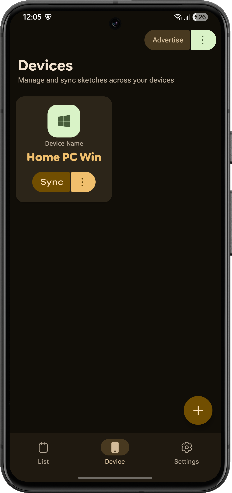
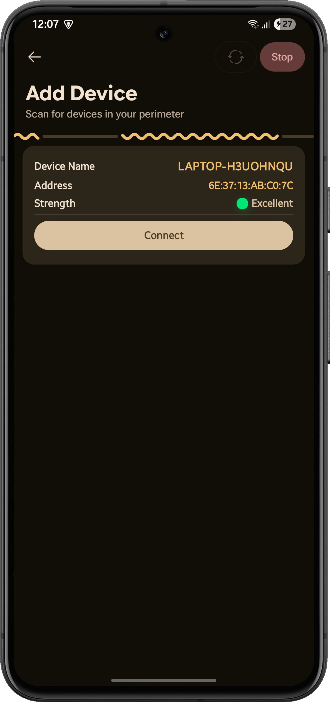
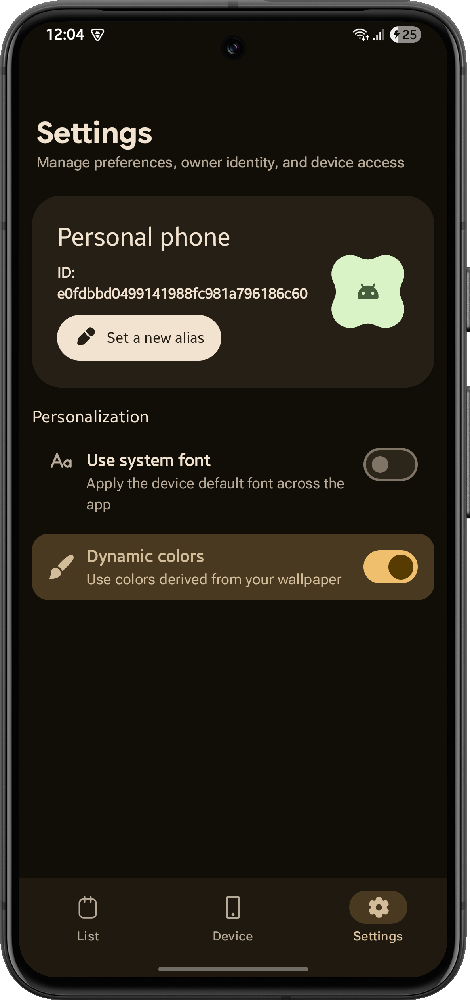
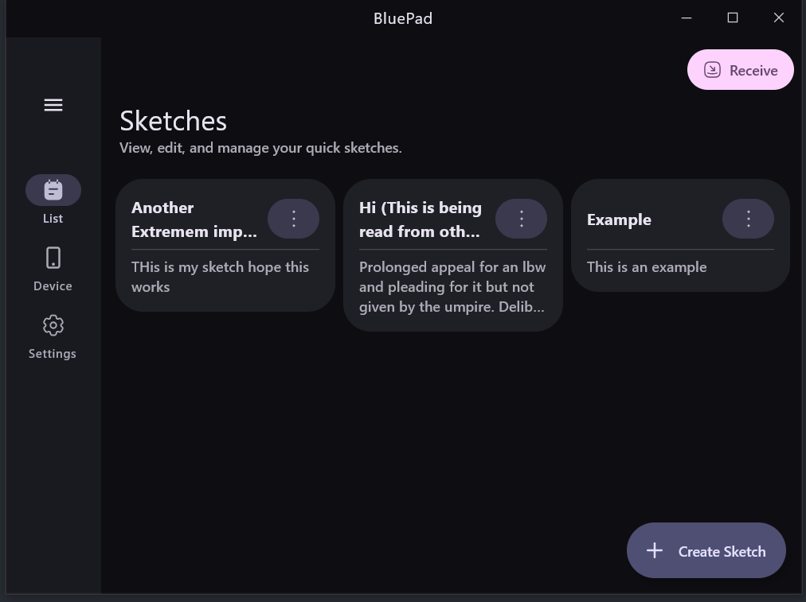
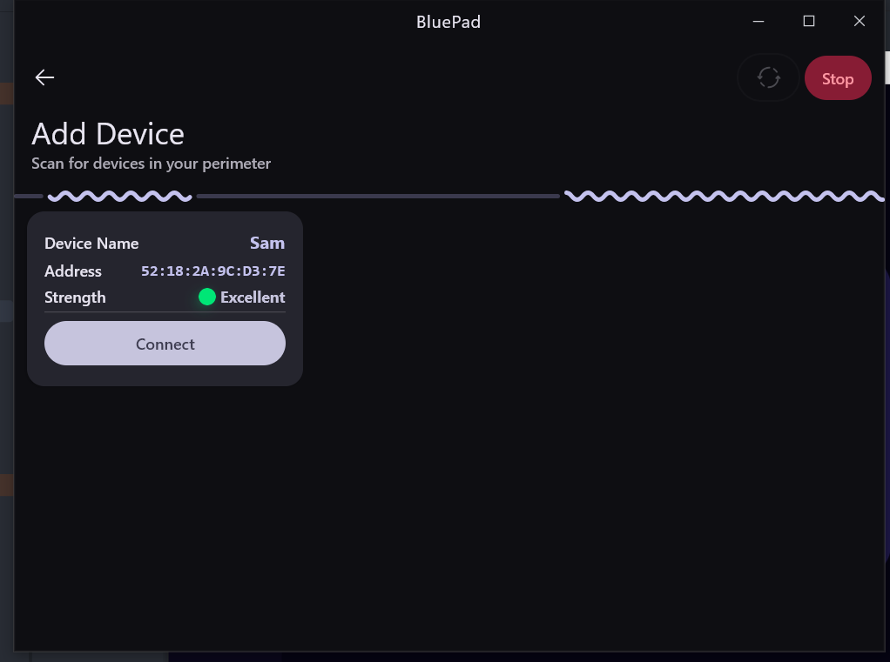
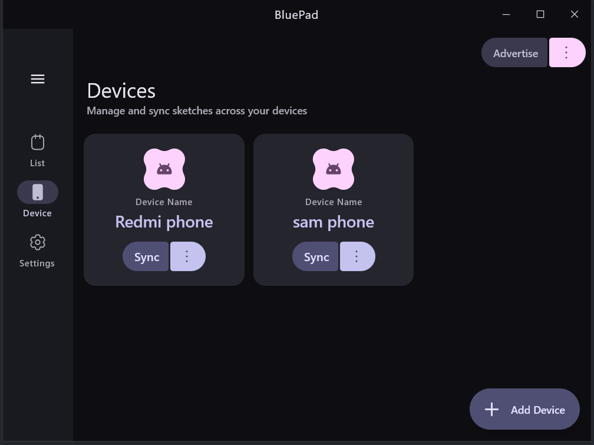

# 🟦 BluePad – Proximity-Based Secure Sketch Sync

<p align="center">
  
  
  
  
</p>

## 📌 About & 💡 Motivation

BluePad is a cross-platform, offline-first app for sketching and idea-syncing! Built with Compose Multiplatform and
Kotlin Multiplatform, it’s all about keeping your sketches secure and synced between your own devices without the fuss.

Remember the nostalgia of the old days, when we used to stand close to each other, pairing up phones just to send a song
over Bluetooth? It felt personal, local, and direct. We wanted to bring that exact feeling back for your personal data.

So why not create something like that using kotlin to sync notes or sketches between devices.
By leveraging Bluetooth Low Energy (BLE 5), BluePad lets you pass sketches between trusted
devices locally. No cloud accounts, no internet required, and definitely no third-party snooping.

Sync is strictly a user-triggered flow, so your data stays exactly where you want it, when you want it.

## ✨ Key Features

- **🎨 Sketch Management (CRUD)**: Create, read, update, and delete sketches locally.
- **⚡ Offline Proximity Sync**: Sync sketches between devices using BLE 5. The sync is user-initiated with an explicit "
  Sync on one, Advertise on the other" workflow, preventing unexpected data transfers.
- **🔒 Secure by Design**:
    - **On-Disk Encryption**: Local sketches and configuration details are encrypted.
    - **User Approval**: Every incoming sketch must be explicitly approved by the user before it is saved to the local
      database.
- **🌈 Personalization**:
    - **Dynamic Colors**: Material 3 dynamic color scheme (System Accent) support for Windows and Android.
    - **Custom Fonts**: Seamless integration with your operating system's default system fonts.

## 📷 Screenshots

### Android

<p align="center">
   
   
   
   
</p>

### Windows

<p align="center">
   
   
   
</p>

To check out the working of the app follow this [video](https://youtu.be/YaNYKMAs0pU).

## 🚀 Getting Started

To build `BluePad` from source follow these instructions

### Prerequisites

#### 🤖 Android & 🪟 Windows (Full Feature Support)

- **JDK:** 22 or higher.
- **Environment**: Windows 10/11 (BLE 5 hardware support required for device syncing).
- **C++ Build Tools**: Visual Studio 2022 (Community or higher) with the "Desktop development with C++" workload
  installed. This is required to compile the underlying C++ Bluetooth modules.
- **Windows SDK**: Usually bundled with the Visual Studio C++ workload. (Tested on Version 10.0.26100.0)
- **CMake**: Installed and added to your System PATH (often handled by the IDE or Visual Studio)
- **IDE**: IntelliJ IDEA or Android Studio with the Kotlin Multiplatform plugin.

#### 🍎 macOS (Limited Support)

Runs successfully, but is limited to local sketch management. Bluetooth Low Energy (BLE 5) advertising and sync
functionality are not supported on macOS

#### 🐧 Linux (Not yet supported)

### Clone the Repository

```bash
    git clone https://github.com/tuuhin/BluePad
    cd BluePad
```

### Run on Android

Sync features require real devices. Emulators are not suitable for BLE or Bluetooth testing.

- Open the project in Android Studio
- Select the `androidApp` configuration
- Run on a physical device (Bluetooth required)

### Run on Desktop (JVM)

- Use the provided `desktopRun` configuration

## 📦 External Libraries Used

- [Kotlin Multiplatform](https://kotlinlang.org/docs/multiplatform.html) Used to share business logic, sync state
  machines, and data models across Android and Desktop targets.
- [Kotlin Coroutines](https://github.com/Kotlin/kotlinx.coroutines) Used for asynchronous operations such as device
  discovery, networking, database access, and sync workflows.
- [Kotlin Serialization](https://github.com/Kotlin/kotlinx.serialization) Used to serialize sketch data and protocol
  messages for transport across devices.
- [Kotlinx DateTime](https://github.com/Kotlin/kotlinx-datetime) Used for platform-independent timestamps (creation
  time, last modified time, sync metadata).
- [Kotlinx Immutable Collections](https://github.com/Kotlin/kotlinx.collections.immutable) Used to model UI and sync
  state safely and predictably without accidental mutation.
- [Kotlinx IO](https://github.com/Kotlin/kotlinx-io) Used for multiplatform I/O operations and stream handling.
- [Compose Multiplatform](https://www.jetbrains.com/compose-multiplatform) Used to build a shared declarative UI for
  Android and Desktop.
- [Compose Adaptive & Navigation 3](https://developer.android.com/jetpack/compose/adaptive) Used to adapt layouts across
  different window sizes and manage navigation in a multiplatform-friendly way.
- [Material 3 (Compose)](https://m3.material.io) Provides modern Material Design components and theming.
- [Compose Toast](https://github.com/The-Best-Is-Best/ComposeToast) Used for lightweight user feedback during sync
  events and error states.
- [Koin](https://insert-koin.io) Used for dependency injection across shared and platform-specific modules.
- [BuildKonfig](https://github.com/yshrsmz/BuildKonfig) Used to define compile-time configuration values shared across
  platforms.
- [Room](https://developer.android.com/training/data-storage/room) Used for local storage of sketches, device metadata,
  and sync state.
- [AndroidX DataStore](https://developer.android.com/topic/libraries/architecture/datastore) Used
  for lightweight key-value storage such as user preferences and pairing state.
- [Kable (BLE)](https://github.com/JuulLabs/kable) Used for Bluetooth Low Energy discovery and
  proximity-based device detection.
- [Kotlin Crypto (SHA-2 & Secure Random)](https://github.com/KotlinCrypto) Used for hashing, nonce
  generation, and session-level cryptographic primitives.
- [Cryptography Core](https://github.com/whyoleg/cryptography-kotlin) A multiplatform cryptography library used for
  secure communication.
- [Moko Permissions](https://github.com/icerockdev/moko-permissions) Used to manage runtime
  permissions in a multiplatform-safe way.
- [Kermit](https://github.com/touchlab/Kermit) Used for structured, multiplatform logging.
- [Nucleus (KDroidFilter)](https://github.com/kdroidFilter/Nucleus) Used for native access, JNI management, and
  decorated window support on Desktop.

## 📚 What I Learned

- Practical limitations of **BLE discovery** across devices and operating systems
- How the BLE 5.0 Extended Advertising stack differs from BLE 4.2 (more insights on how BLE works)
- Structuring Kotlin Multiplatform projects with clear platform boundaries
- Working with native C modules and building APIs out of them
- Working with `winRT` and how Bluetooth APIs are handled in Windows
- A mention to [NativeAccess Library](https://github.com/kdroidFilter/NucleusNativeAccess) which helps to
  create JVM library based on the native code implementation

## 🚧 Some plans for later

Note: Work on BluePad is currently paused! ⏸️
Since the app still breaks more often than a fragile vase in a earthquake zone, I'm taking a break. Hopefully, by the
time I come back to resume development, a fine collection of GitHub issues will be waiting for me to fix! 😅

- [ ] Incremental sketch synchronization
- [ ] Better conflict resolution
- [ ] Richer sketch types
- [ ] Improved accessibility
- [ ] Full macOS support
- [ ] Linux support
- [ ] Performance optimizations
- [ ] Further modularization

## 🤝 Contributors & 🐛 Issues

Contributions are welcome! If you'd like to help improve BluePad:

- Check out the active [Issues](https://github.com/tuuhin/BluePad/issues) or open a new one to report bugs or suggest
  enhancements.
- Fork the repository, create a branch, and submit a Pull Request.

If you encounter any bugs, have questions, or want to discuss feature designs, please open an issue on GitHub.

## 🏁 The Conclusion

And that’s the story of BluePad! 🎬

Building this was a wild ride through the world of Bluetooth stacks, JNI bridges, and the "it works on my machine" magic
of Kotlin Multiplatform

Turns out, Bluetooth isn't just for your wireless headphones; it’s a pretty capable (if sometimes grumpy) companion for
secure, local data syncing. We hope exploring BluePad gives you some inspiration for your own offline-first adventures.
